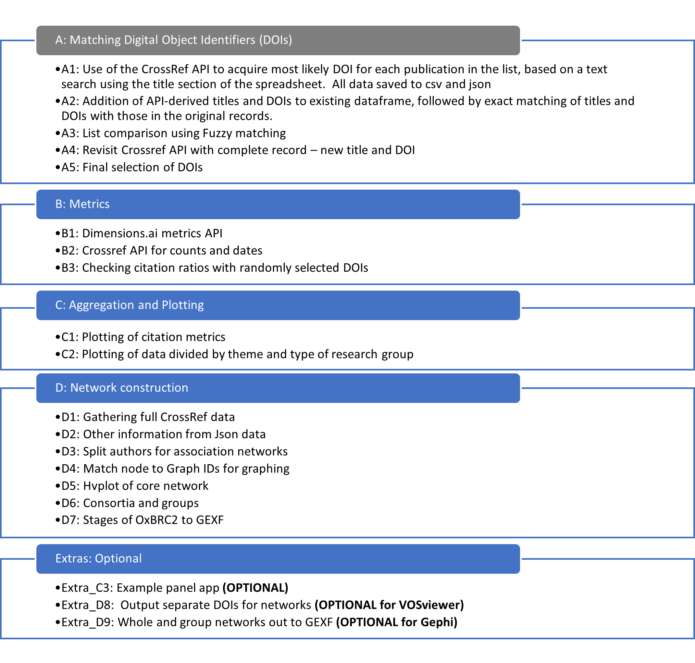

# Index of notebooks for OxBRC2 bibliometric analysis:


The enclosed notebooks comprise the analysis for ...

The final analysis for the metrics was run on the 27th Jan 2021 (when data was obtained from the respective APIs). Python (Jupyter) notebooks are available describing the entire analysis from the original curated list of publications, through to the lists of DOIs used to generate the author networks. Majority of the analysis can be run from these notebooks, except for a final manual check of the available titles and identifiers. The analyses make use of a number of packages from the PyData ecosystem, including Jupyter, IPython, Pandas, Numpy, Scipy, Holoviz libraries (Bokeh, Hvplot, Holoviews, Panel, Networkx, Requests, FuzzyWuzzy and Habanero for the Crossref API).

the research environment can be created using
`conda env create -f BRC_biblio.yml`

</img>

### Section A: Matching Digital Object Identifiers (DOIs) 
The publications included in the current paper were defined as those that were reported to the NIHR as the output of the Oxford Biomedical Research Centre (BRC) between 1st April 2012 and the 31st March 2017.  This was the second period of funding for this research centre, hence ‘OxBRC2’.   Individual papers were identified by individuals involved in research facilitation within Oxford BRC and from Bodleian Heathcare Libraries in the University of Oxford.  Inclusion criteria supplied by NIHR for publications and stipulate amongst other things that work This first section deals with the aggregated data returned across the BRC, where final details of publications were not yet available or publication lag meant individual items were returned in more than one year.

The notebooks deal with using available online resources to find the closest matches to the title and, where possible the Digital Object Identifiers (DOIs) available and recorded. Initially the records were cleaned to aid matching a single Digital Object Identifier (DOI) for each reference, a unique identifier that makes obtaining further information such as citation data possible.

A first attempt to find a matching title and Digital object identifier (DOI) for all of the entries in the collated list of references form OxBRC2. The title field to question the Crossref API (<a href='https://api.Crossref.org'> https://api.Crossref.org</a>) and obtain the closest matched title  on record and matching DOIs.

After cleaning text the returned data from Crossref was compared to the original file for exact matches in title, DOI, or both. Titles and DOIs obtained from Crossref were used to used to compare to the orgininal record, and the score of a fuzzy-match for each reference was visualized.   

For references with no match or only a weak match after this process, the Crossref text query tool for matching refences <a href='https://apps.Crossref.org/simpleTextQuery'> (https://apps.Crossref.org/simpleTextQuery)</a> 
    
Data from both searches were used alongside manual searches of the bibliographic databases, pubmed (<a href='https://www.ncbi.nlm.nih.gov/pubmed/'> https://www.ncbi.nlm.nih.gov/pubmed/ </a>) and euroPMC (<a href='https://europepmc.org/'> https://europepmc.org/ </a>) and finally further internet searches where required.  This process produced a single DOI for each of the publications in the original list (where one existed).
    

---
### Section B: Gathering Metrics

The curated list of DOIs for publications generated during BRC Oxford phase2, created in section **A** was used to query both the Dimensions.ai metrics API (using the Requests Python package), and the Crossref API (using the Habanero package) 

In order to confirm results found with OxBRC2 data, A check on the assumption that the Field Citation Ratio (FCR) for all available references will on average =1. was carried out using randomly-selected DOIs from Crossref and the Dimensions metrics API 
    

---
### Section C: Aggregation and Plotting    

Calculation of the overall (OxBRC2-wide) metrics for OxBRC2 and plots without separating data by research group or type</p>
2 - Further detail of research output by research group and type of group (established Themes, new Working Groups and Other work).

All the figures in the paper are produced, as well as a number of others that may be of interest.


---
### Section D: Construction of Author-association Networks 

Using a list of all the valid DOIs, we query the CrossRef API to acquire the lists of authors for each refernence and the publication date. This is followed by a look at the Journals and Publishers used in OxBRC2.


The lists of authours in each reference can then be used to generate a long list of pairwise connections between authors, each with date information and weightings for the connection.  

1. Split the author list for each reference into 1-to-1 author connections (edges)
2. Clean up the names of each of the authors (defaulting to Intials with dots of each previous name then last name Capitalised)
3. Extract primary affiliations for authors if present
4. Add additional details about research group and type of groups (Themes/Working Groups/Other) to each line/edge
5. Save list of edges

6. Find unique list of authors and link DOIs and group information to each
7. Look for Oxford in affiliations 
8. Export author list

Reindex nodes and edges for matching the data can be built into networks using the Python networkx library. these can be visualised, or exported to Gephi, as can sub-networks focused either on part of the OxBRC2 funding period, or on certain research groups or group-types.


---
### Section E(xtras): Other notebooks that might be of interest

Extra_C3: and example of an Panel app to explore the data

Extra_D8: Splitting the list of DOIs into sublists that can be used in VOSviewer 

Extra_D9: Splitting the author-association network into subnetworks based on research group type

---

### The optional use of VOSviewer and Gephi

Author association netowrks can be created in  VOSviewer (version 1.6.11, https://www.vosviewer.com/) for comparison. Where individual authors were associated with more than one research group, all associations were recorded, with the most prevalent used as the primary group (or type of group) for the author (notebook Extra_D8). 
For VOSviewer, each list of DOIs was imported via the Crossref DOI resource. 

Then networks were created with fractional counting of co-authorship, with no exclusion of papers with large numbers of authors. Additionally, a thesaurus file was constructed to aid with aggregation of records where authors have multiple names or initials that are recorded inconsistently. No restriction was made on the minimum number of publications for inclusion. 
The resulting network files (.gml or .GEXF) were exported for visualization analysis in the Gephi (version 0.9.2, https://gephi.org/). Each of the three networks were analysed within Gephi to obtain measure of complexity (nodes and edges) and connectivity (average path length) and to filter networks for final figures.

Resaults were the same as with Networkx.


```python
from IPython.display import FileLinks
FileLinks('.', included_suffixes='.ipynb', recursive=False)
```


./<br>
&nbsp;&nbsp;<a href='./A0_Index_start_here.ipynb' target='_blank'>A0_Index_start_here.ipynb</a><br>
&nbsp;&nbsp;<a href='./A1_CrossRef_title_to_DOI_11Oct19.ipynb' target='_blank'>A1_CrossRef_title_to_DOI_11Oct19.ipynb</a><br>
&nbsp;&nbsp;<a href='./A2_matching_CrossRef_titles_and_DOIs_11Oct19.ipynb' target='_blank'>A2_matching_CrossRef_titles_and_DOIs_11Oct19.ipynb</a><br>
&nbsp;&nbsp;<a href='./A3_List_comparison_FuzzyMatch.ipynb' target='_blank'>A3_List_comparison_FuzzyMatch.ipynb</a><br>
&nbsp;&nbsp;<a href='./A4_CrossRef_complete_to_DOI_14Oct19.ipynb' target='_blank'>A4_CrossRef_complete_to_DOI_14Oct19.ipynb</a><br>
&nbsp;&nbsp;<a href='./A5_assign_primary_DOIs.ipynb' target='_blank'>A5_assign_primary_DOIs.ipynb</a><br>
&nbsp;&nbsp;<a href='./B1_Add_Dimensions_metrics_by_DOIs.ipynb' target='_blank'>B1_Add_Dimensions_metrics_by_DOIs.ipynb</a><br>
&nbsp;&nbsp;<a href='./B2_DOI_to_CrossRef_citation_metrics_and_dates.ipynb' target='_blank'>B2_DOI_to_CrossRef_citation_metrics_and_dates.ipynb</a><br>
&nbsp;&nbsp;<a href='./B3_Check_citation_ratios_from_Dimensions_metrics_with_random_DOIs.ipynb' target='_blank'>B3_Check_citation_ratios_from_Dimensions_metrics_with_random_DOIs.ipynb</a><br>
&nbsp;&nbsp;<a href='./C1_plotting_of_BRC_citation_metrics.ipynb' target='_blank'>C1_plotting_of_BRC_citation_metrics.ipynb</a><br>
&nbsp;&nbsp;<a href='./C2_plotting_of_BRC_ouput_by_research_grouping.ipynb' target='_blank'>C2_plotting_of_BRC_ouput_by_research_grouping.ipynb</a><br>
&nbsp;&nbsp;<a href='./D1_All_Gather_CrossRef_records_and_author_numbers.ipynb' target='_blank'>D1_All_Gather_CrossRef_records_and_author_numbers.ipynb</a><br>
&nbsp;&nbsp;<a href='./D2_all refs_json_other information.ipynb' target='_blank'>D2_all refs_json_other information.ipynb</a><br>
&nbsp;&nbsp;<a href='./D3_split_authors_for_association_network.ipynb' target='_blank'>D3_split_authors_for_association_network.ipynb</a><br>
&nbsp;&nbsp;<a href='./D4_match_nodeIDs_for_Graphs.ipynb' target='_blank'>D4_match_nodeIDs_for_Graphs.ipynb</a><br>
&nbsp;&nbsp;<a href='./D5_NetworkX_to_hvplot_figure.ipynb' target='_blank'>D5_NetworkX_to_hvplot_figure.ipynb</a><br>
&nbsp;&nbsp;<a href='./D6_Consortia_groups_and_unknowns_in_author_lists.ipynb' target='_blank'>D6_Consortia_groups_and_unknowns_in_author_lists.ipynb</a><br>
&nbsp;&nbsp;<a href='./D7_NetworkX_timestamp_GEXFout.ipynb' target='_blank'>D7_NetworkX_timestamp_GEXFout.ipynb</a><br>
&nbsp;&nbsp;<a href='./Extra_C3_plotting_of_BRC_themes_Panel_app.ipynb' target='_blank'>Extra_C3_plotting_of_BRC_themes_Panel_app.ipynb</a><br>
&nbsp;&nbsp;<a href='./Extra_D8_BRC_themes_for networks.ipynb' target='_blank'>Extra_D8_BRC_themes_for networks.ipynb</a><br>
&nbsp;&nbsp;<a href='./Extra_D9_NetworkX_describe_OxBRC2_networks_GEXFout.ipynb' target='_blank'>Extra_D9_NetworkX_describe_OxBRC2_networks_GEXFout.ipynb</a><br>


```python

```


```python

```
